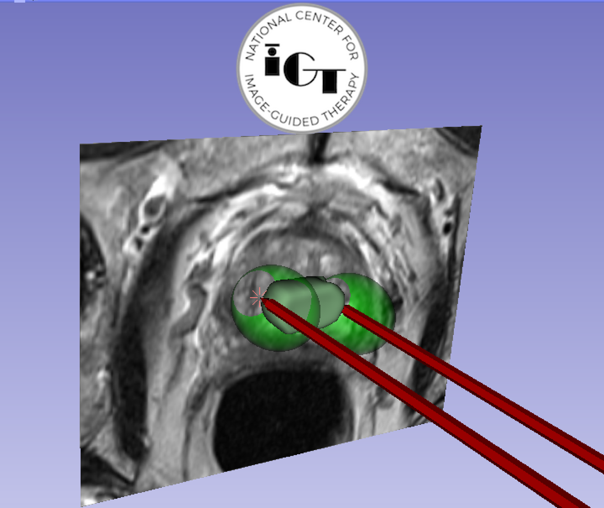
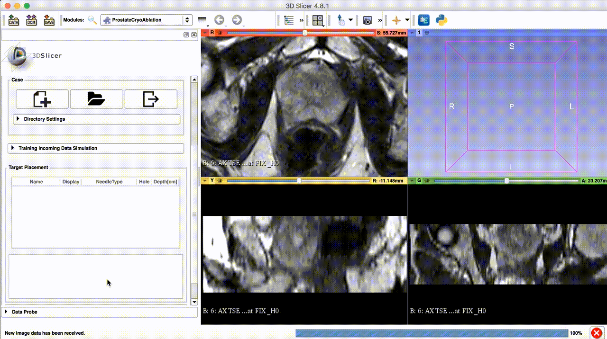
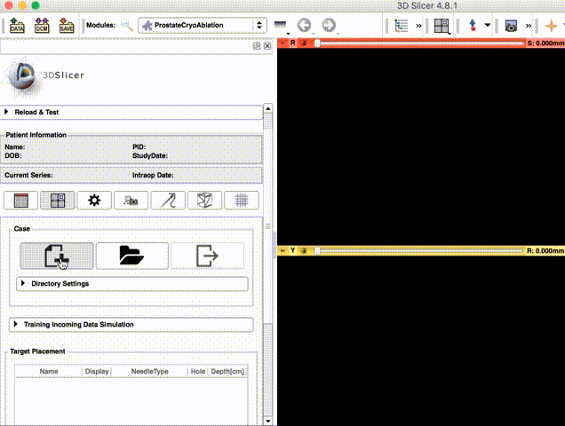
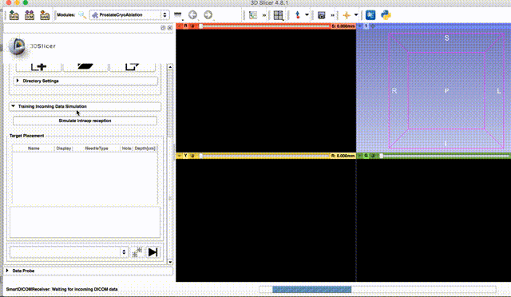
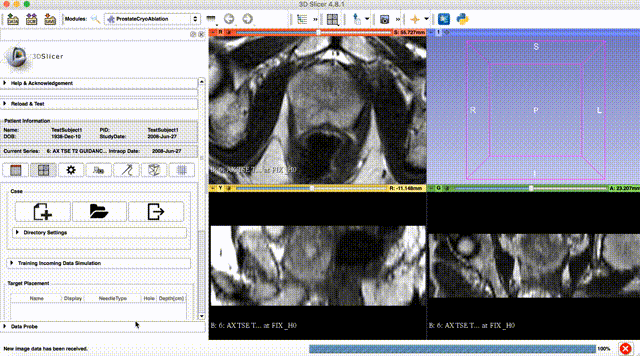
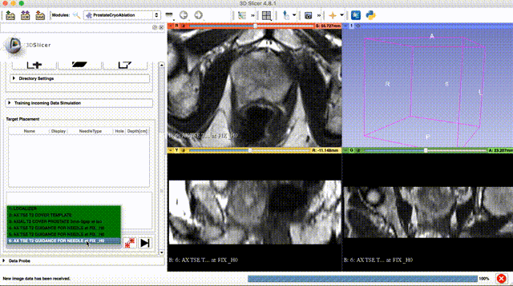
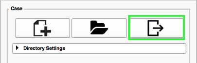

### Overview

SlicerCryoAblation is a [3D Slicer](http://slicer.org) extension designed to support the workflow of the in-bore MRI-guided therapies (see references below for [clinical context](http://ncigt.org/prostate-biopsy)). 
SlicerCryoAblation was developed and tested to support transperineal prostate cryo-ablation procedures in the [Advanced Multimodality Image Guided Operating (AMIGO)](http://www.brighamandwomens.org/research/amigo/default.aspx) at the Brigham and Women's Hospital, Boston. Its applicability to other types of procedures has not been evaluated.
Capabilities of SlicerCryoAblation include:
* patient DICOM series receiving and 3D volume reconstruction.
* calibration of the intra-procedural image frame of reference with the transperineal biopsy template
* planning of the prostate cryo-ablation procedure
* manual segmentation of the tumor
* structured collection of the relevant data during the course of the procedure (images, results of segmentation and registration)
* visualization of the intra-procedural images and predicted affective ice ball 

### Usage:
#### With 3D slicer main window.
1. Install the SlicerCryoAblation extension. For more details, please refer to [SliceTracker user guide](https://slicerprostate.gitbooks.io/slicetracker) for installation steps.
   After install the extension, the user needs to switch to the module `ProstateCryoAblation`.

2. Create a new case by clicking the `+` button.

3. Users can either push DICOM data to 3D Slicer from MR scanner or use the simulator for training.

4. Choose the "Cover Template" series to register the Zframe to the scanner. User will be prompt to place two points in the Red Slice Widget to defined a ROI.

5. Choose the "Cover Prostate" series for target planning, user can set the needle type in the drop down combo-box. Also visualization of individual needle is possible by checking the checkbox in each row in the table.

6. Save the case by clicking the 'Exit' button. User will be asked if the case is completed or not.

#### Slicelet mode
The user have the option to run the module in a slicelet mode
Type the following command in a terminal in Linux or Mac OS system.
~~~~
$ cd ${Slicer_execution_path}
$ ./Slicer --no-main-window --python-script lib/Slicer-x.x/qt-scripted-modules/ProstateCryoAblation.py
~~~~

For Windows system, see the link for more information [Slicelet Mode](https://www.slicer.org/wiki/Documentation/Nightly/Developers/Slicelets)
### Disclaimer

ProstateCryoAblation, same as 3D Slicer, is a research software. **ProstateCryoAblation is NOT an FDA-approved medical device**. It is not intended for clinical use. The user assumes full responsibility to comply with the appropriate regulations.  

### Support

Please feel free to contact us for questions, feedback, suggestions, bugs, or you can create issues in the issue tracker: https://github.com/leochan2009/SlicerZframeRegistration/issues

* [Longquan Chen](https://github.com/leochan2009) lchen@bwh.harvard.edu

* [Christian Herz](https://github.com/che85) cherz@bwh.harvard.edu

* [Junichi Tokuda](https://github.com/tokjun) tokuda@bwh.harvard.edu

### Acknowledgments

Development of ProstateCryoAblation is supported in part by the following NIH grants: 
* R01 EB020667 OpenIGTLink: a network communication interface for closed-loop image-guided interventions
* R01 CA111288 Enabling Technologies for MRI-guided prostate interventions
* P41 EB015898 National Center for Image Guided Therapy (NCIGT), http://ncigt.org

The source code was adopted from the open source projects
as follows:
* [ProstateNav module of 3D Slicer version
  3](https://www.slicer.org/slicerWiki/index.php/Modules:ProstateNav-Documentation-3.6) (see source
  code [here](https://github.com/SlicerProstate/ProstateNav), no revision
  history); although we
  do not have the precise record of contribution to that functionality in the
  ProstateNav module, we believe main contributors were Junichi Tokuda and
  Simon Di Maio (while at BWH, now at [Intuitive
  Surgical](http://www.intuitivesurgical.com/))
* [SliceTracker](https://github.com/SlicerProstate/SliceTracker), courtesy Christian Herz
  @che85  

### References

The following publications led to the development of ProstateCryoAblation.
1. Tokuda J., Tuncali K., Iordachita I., Song S-EE., Fedorov A., Oguro S., Lasso A., Fennessy FM., Tempany CM., Hata N. 2012. In-bore setup and software for 3T MRI-guided transperineal prostate biopsy. Physics in medicine and biology 57:5823–5840. DOI: [10.1088/0031-9155/57/18/5823](http://doi.org/10.1088/0031-9155/57/18/5823): **procedure technical setup**.
2. DiMaio S, Samset E, Fischer G, Iordachita I, Fichtinger G, Jolesz F, et al. Dynamic MRI scan plane control for passive tracking of instruments and devices. MICCAI. 2007;10:50–8.